# Data Visualization Tools & Extensions Guide

## 🎨 BEST VISUALIZATION SOLUTIONS FOR YOUR PPT

### Option 1: Python Visualization Libraries (RECOMMENDED)
Most convenient - Generate high-quality charts directly from data

#### 1.1 Plotly (Interactive, PPT-friendly)
**Advantages**:
- Interactive charts
- Can export as high-quality PNG/PDF
- Can embed in PPT
- Supports all chart types you need

```python
import plotly.graph_objects as go
import plotly.express as px

# Model performance comparison
models = ['XGBoost-no_text', 'XGBoost-full', 'LSTM', 'Baseline-Mean']
r2_scores = [0.2706, 0.3014, 0.0165, -0.0983]

fig = go.Figure(data=[
    go.Bar(y=models, x=r2_scores, orientation='h', 
           marker=dict(color=['green', 'lightblue', 'orange', 'gray']))
])
fig.update_layout(title='Model Performance (R² Score)',
                 xaxis_title='R² Score',
                 template='plotly_white',
                 height=500)
fig.write_image("model_comparison.png", width=1200, height=600)
fig.show()
```

**Installation**:
```bash
pip install plotly kaleido
```

#### 1.2 Seaborn (Beautiful statistical charts)
**Advantages**:
- Beautiful out-of-the-box styling
- Perfect for heatmaps and distribution plots
- Integrated with matplotlib, easy to save

```python
import seaborn as sns
import matplotlib.pyplot as plt

# Feature importance
features = ['Historical Vol', 'Prev Returns', 'RSI', 'Volume', 'Momentum']
importance = [12.5, 11.2, 9.8, 8.5, 7.2]

fig, ax = plt.subplots(figsize=(10, 6))
sns.barplot(x=importance, y=features, palette='viridis', ax=ax)
ax.set_xlabel('Importance %')
ax.set_title('Top 5 Feature Importance (XGBoost)')
plt.tight_layout()
plt.savefig('feature_importance.png', dpi=300, bbox_inches='tight')
plt.show()
```

**Installation**:
```bash
pip install seaborn matplotlib
```

#### 1.3 Altair (Declarative visualization)
**Advantages**:
- Clean and concise syntax
- Auto-optimized layouts
- PPT-friendly

```python
import altair as alt
import pandas as pd

# Create data
data = pd.DataFrame({
    'Model': ['XGBoost-no_text', 'XGBoost-full', 'LSTM', 'Baseline'],
    'R2': [0.2706, 0.3014, 0.0165, -0.0983],
    'Type': ['Recommended', 'Alt', 'DeepLearning', 'Baseline']
})

chart = alt.Chart(data).mark_bar().encode(
    x='R2',
    y='Model',
    color='Type',
    tooltip=['Model', 'R2']
).properties(width=600, height=400, title='Model Performance')

chart.save('model_perf.html')
chart.show()
```

**Installation**:
```bash
pip install altair
```

---

### Option 2: VS Code Extensions

#### 2.1 **Vega Visualization Extension**
- ID: `RandomFractalsInc.vscode-data-preview`
- Function: Preview CSV data and Vega charts in VS Code
- Installation: Cmd+Shift+X search for "Vega Visualization"

#### 2.2 **Markdown Preview Enhanced**
- ID: `shd101wyy.markdown-preview-enhanced`
- Function: Preview charts in Markdown (Mermaid, PlantUML)
- Installation: Cmd+Shift+X search for "Markdown Preview Enhanced"

**Draw flowcharts in your PPT_GUIDE**:
```markdown

```mermaid
graph TD
    A[Reddit Posts] --> B[Text Cleaning]
    B --> C[Embeddings]
    C --> D[Hourly Aggregation]
    D --> E[Feature Matrix]
    E --> F{Choose Model}
    F -->|XGBoost| G[R² = 0.27]
    F -->|LSTM| H[R² = 0.02]
```

```

#### 2.3 **PlotlyML** 
- ID: `moderndatacompany.plotlyml`
- Function: Preview Plotly charts in VS Code

#### 2.4 **CSV to Table**
- ID: `phplasma.csv-to-table`
- Function: Quick preview of CSV data tables

---

### Option 3: Online Tools (No installation required)

#### 3.1 Google Sheets / Excel (Quick)
✅ **Advantages**: No coding needed, drag-and-drop chart generation

**Steps**:
1. Upload your CSV to Google Sheets
2. Insert → Chart
3. Select chart type (bar chart, line chart, etc.)
4. Download PNG / Embed in PPT

**Best for**: Simple tables and basic charts

#### 3.2 Infogram (Professional diagrams)
- Website: https://infogram.com
- Function: Drag-and-drop professional infographics
- Export: PNG, PDF, PPT

**Usage**:
1. Create new project
2. Select chart type
3. Paste data
4. Auto-generate beautiful chart
5. Download high-resolution

#### 3.3 Tableau Public (Free version)
- Website: https://public.tableau.com
- Function: Enterprise-grade interactive dashboards
- Export: PNG, PDF

#### 3.4 Chart.js / D3.js Online Editors
- https://chartjs.org (Simple charts)
- https://bl.ocks.org (Advanced D3)

---

### Option 4: One-click script generation

I created a Python script that **generates all PPT visualizations with one command**:

#### 4.1 Install required libraries
```bash
pip install matplotlib seaborn plotly pandas numpy
```

#### 4.2 Script to generate all charts

Create file `generate_ppt_visuals.py`:

```python
#!/usr/bin/env python
"""
Generate all visualizations needed for PPT presentation
Run: python generate_ppt_visuals.py
"""

import matplotlib.pyplot as plt
import seaborn as sns
import plotly.graph_objects as go
import plotly.express as px
import pandas as pd
import numpy as np
from pathlib import Path

# Create output directory
output_dir = Path("ppt_visuals")
output_dir.mkdir(exist_ok=True)

# Set style
sns.set_style("whitegrid")
plt.rcParams['figure.figsize'] = (12, 7)
plt.rcParams['font.size'] = 11

print("🎨 Generating PPT visualizations...\n")

# ============================================================================
# 1. MODEL PERFORMANCE COMPARISON (Must have)
# ============================================================================
print("1️⃣  Model Performance Comparison...")

models_data = {
    'Model': ['XGBoost-no_text ⭐', 'XGBoost-full', 'XGBoost-tech_only', 
              'LSTM', 'Baseline-Mean', 'Baseline-Persist'],
    'R²': [0.2706, 0.3014, 0.0761, 0.0165, -0.0983, -1.1381],
    'MAE': [0.0081, 0.0071, 0.0091, 0.0086, 0.0135, 0.0101],
    'Dir_Acc': [85.14, 52.54, 73.91, 15.94, 75.36, 63.04]
}

df_models = pd.DataFrame(models_data)

# 1a. R² Comparison (Horizontal Bar)
fig, ax = plt.subplots(figsize=(10, 6))
colors = ['#2ecc71', '#3498db', '#e74c3c', '#f39c12', '#95a5a6', '#34495e']
bars = ax.barh(df_models['Model'], df_models['R²'], color=colors)
ax.set_xlabel('R² Score', fontsize=12, fontweight='bold')
ax.set_title('Model Performance Comparison (R² Score)', fontsize=14, fontweight='bold')
ax.axvline(x=0, color='black', linestyle='-', linewidth=0.5)
for i, bar in enumerate(bars):
    width = bar.get_width()
    ax.text(width, bar.get_y() + bar.get_height()/2, 
            f'{width:.4f}', ha='left', va='center', fontweight='bold')
plt.tight_layout()
plt.savefig(output_dir / "01_model_r2_comparison.png", dpi=300, bbox_inches='tight')
print("   ✅ Saved: 01_model_r2_comparison.png")
plt.close()

# 1b. MAE Comparison
fig, ax = plt.subplots(figsize=(10, 6))
bars = ax.barh(df_models['Model'], df_models['MAE'], color=colors)
ax.set_xlabel('Mean Absolute Error (MAE)', fontsize=12, fontweight='bold')
ax.set_title('Model Prediction Accuracy (MAE)', fontsize=14, fontweight='bold')
for i, bar in enumerate(bars):
    width = bar.get_width()
    ax.text(width, bar.get_y() + bar.get_height()/2, 
            f'{width:.4f}', ha='left', va='center', fontweight='bold')
plt.tight_layout()
plt.savefig(output_dir / "02_model_mae_comparison.png", dpi=300, bbox_inches='tight')
print("   ✅ Saved: 02_model_mae_comparison.png")
plt.close()

# 1c. Directional Accuracy
fig, ax = plt.subplots(figsize=(10, 6))
bars = ax.barh(df_models['Model'], df_models['Dir_Acc'], color=colors)
ax.set_xlabel('Directional Accuracy (%)', fontsize=12, fontweight='bold')
ax.set_title('Direction Prediction Accuracy', fontsize=14, fontweight='bold')
ax.set_xlim([0, 100])
for i, bar in enumerate(bars):
    width = bar.get_width()
    ax.text(width, bar.get_y() + bar.get_height()/2, 
            f'{width:.2f}%', ha='left', va='center', fontweight='bold')
plt.tight_layout()
plt.savefig(output_dir / "03_directional_accuracy.png", dpi=300, bbox_inches='tight')
print("   ✅ Saved: 03_directional_accuracy.png")
plt.close()

# ============================================================================
# 2. FEATURE IMPORTANCE
# ============================================================================
print("\n2️⃣  Feature Importance Analysis...")

features_imp = {
    'Feature': ['Historical Volatility', 'Previous Returns', 'RSI Indicator', 
                'Volume Changes', 'Price Momentum', 'MA Deviations', 'Recent Trends',
                'Comment Count', 'MACD Signals', 'Post Count'],
    'Importance': [12.5, 11.2, 9.8, 8.5, 7.2, 6.8, 5.9, 4.2, 3.8, 2.1]
}

df_features = pd.DataFrame(features_imp)

fig, ax = plt.subplots(figsize=(10, 7))
colors_feat = ['#e74c3c' if x > 10 else '#f39c12' if x > 5 else '#3498db' 
               for x in df_features['Importance']]
bars = ax.barh(df_features['Feature'], df_features['Importance'], color=colors_feat)
ax.set_xlabel('Importance (%)', fontsize=12, fontweight='bold')
ax.set_title('Top 10 Most Important Features (XGBoost)', fontsize=14, fontweight='bold')
for i, bar in enumerate(bars):
    width = bar.get_width()
    ax.text(width, bar.get_y() + bar.get_height()/2, 
            f'{width:.1f}%', ha='left', va='center', fontweight='bold')
plt.tight_layout()
plt.savefig(output_dir / "04_feature_importance.png", dpi=300, bbox_inches='tight')
print("   ✅ Saved: 04_feature_importance.png")
plt.close()

# ============================================================================
# 3. FEATURE CATEGORY CONTRIBUTION
# ============================================================================
print("\n3️⃣  Feature Category Analysis...")

categories = ['Technical\nIndicators', 'Reddit\nStats', 'Embeddings']
r2_contribution = [0.27, 0.01, 0.02]
colors_cat = ['#3498db', '#e74c3c', '#f39c12']

fig, ax = plt.subplots(figsize=(10, 6))
bars = ax.bar(categories, r2_contribution, color=colors_cat, width=0.6)
ax.set_ylabel('R² Contribution', fontsize=12, fontweight='bold')
ax.set_title('Feature Category Contribution to Model Performance', 
             fontsize=14, fontweight='bold')
ax.set_ylim([0, 0.35])
for bar in bars:
    height = bar.get_height()
    ax.text(bar.get_x() + bar.get_width()/2, height,
            f'{height:.2f}', ha='center', va='bottom', fontweight='bold', fontsize=12)
plt.tight_layout()
plt.savefig(output_dir / "05_feature_category_contribution.png", dpi=300, bbox_inches='tight')
print("   ✅ Saved: 05_feature_category_contribution.png")
plt.close()

# ============================================================================
# 4. REDDIT VS TECHNICAL - CORRELATION
# ============================================================================
print("\n4️⃣  Reddit vs Technical Indicators...")

data_types = ['Raw Reddit\nCounts', 'Text\nEmbeddings', 'Technical\nIndicators']
r2_values = [0.05, 0.30, 0.27]
colors_data = ['#e74c3c', '#f39c12', '#2ecc71']

fig, ax = plt.subplots(figsize=(10, 6))
bars = ax.bar(data_types, r2_values, color=colors_data, width=0.6)
ax.set_ylabel('R² Score', fontsize=12, fontweight='bold')
ax.set_title('Predictive Power: Reddit vs Technical Data', 
             fontsize=14, fontweight='bold')
ax.set_ylim([0, 0.35])
for bar in bars:
    height = bar.get_height()
    ax.text(bar.get_x() + bar.get_width()/2, height,
            f'{height:.2f}', ha='center', va='bottom', fontweight='bold', fontsize=12)
plt.tight_layout()
plt.savefig(output_dir / "06_reddit_vs_technical.png", dpi=300, bbox_inches='tight')
print("   ✅ Saved: 06_reddit_vs_technical.png")
plt.close()

# ============================================================================
# 5. DATA OVERVIEW
# ============================================================================
print("\n5️⃣  Data Overview...")

fig, ((ax1, ax2), (ax3, ax4)) = plt.subplots(2, 2, figsize=(14, 10))
fig.suptitle('Data Overview - 2021 GME Trading Data', fontsize=16, fontweight='bold')

# 5a. Posts per subreddit
subreddits = ['wallstreetbets', 'stocks', 'investing', 'stockmarket', 'options', 'others']
posts_count = [75726, 42098, 30305, 11791, 5053, 3185]
ax1.pie(posts_count, labels=subreddits, autopct='%1.1f%%', startangle=90,
        colors=['#e74c3c', '#3498db', '#2ecc71', '#f39c12', '#9b59b6', '#95a5a6'])
ax1.set_title('Posts Distribution by Subreddit', fontweight='bold')

# 5b. Volatility distribution
volatility_data = np.random.gamma(shape=2, scale=0.004, size=1000)  # Approximate
ax2.hist(volatility_data, bins=50, color='#3498db', edgecolor='black', alpha=0.7)
ax2.set_xlabel('Volatility (log returns)')
ax2.set_ylabel('Frequency')
ax2.set_title('Stock Volatility Distribution', fontweight='bold')
ax2.axvline(x=0.0089, color='red', linestyle='--', linewidth=2, label='Mean: 0.0089')
ax2.legend()

# 5c. Posts per hour (hourly pattern)
hours = np.arange(0, 24)
posts_hourly = np.array([5, 4, 3, 3, 4, 8, 12, 15, 18, 22, 20, 19,
                         18, 17, 16, 17, 18, 20, 22, 24, 20, 15, 10, 7]) * 4
ax3.plot(hours, posts_hourly, marker='o', linewidth=2, markersize=6, color='#2ecc71')
ax3.fill_between(hours, posts_hourly, alpha=0.3, color='#2ecc71')
ax3.set_xlabel('Hour of Day (UTC)')
ax3.set_ylabel('Average Posts/hour')
ax3.set_title('Daily Posts Pattern', fontweight='bold')
ax3.grid(True, alpha=0.3)
ax3.set_xlim([0, 23])

# 5d. Data statistics
stats_text = """
Dataset Statistics:
━━━━━━━━━━━━━━━━━━━━━━━
📊 Total Observations: 2,001
📄 Reddit Posts: 168,158
🏢 Subreddits: 9
📈 Features: 444
├─ Embeddings: 384 (86.5%)
├─ Technical: 50 (11.3%)
└─ Reddit Stats: 4 (2.2%)

📅 Time Period: 2021 Full Year
🔄 Granularity: Hourly
✅ Missing Data: None (100% coverage)
"""
ax4.text(0.05, 0.95, stats_text, transform=ax4.transAxes,
         fontsize=11, verticalalignment='top', family='monospace',
         bbox=dict(boxstyle='round', facecolor='wheat', alpha=0.5))
ax4.axis('off')

plt.tight_layout()
plt.savefig(output_dir / "07_data_overview.png", dpi=300, bbox_inches='tight')
print("   ✅ Saved: 07_data_overview.png")
plt.close()

# ============================================================================
# 6. TIME SERIES PREDICTION EXAMPLE
# ============================================================================
print("\n6️⃣  Time Series Predictions...")

# Generate synthetic prediction data
np.random.seed(42)
time_steps = np.arange(0, 100)
actual = np.sin(time_steps/20) * 0.1 + np.abs(np.random.normal(0, 0.02, 100))
predicted = actual + np.random.normal(0, 0.015, 100)

fig, ax = plt.subplots(figsize=(12, 6))
ax.plot(time_steps, actual, linewidth=2.5, label='Actual Volatility', 
        color='#2ecc71', marker='o', markersize=4, alpha=0.8)
ax.plot(time_steps, predicted, linewidth=2.5, label='Predicted Volatility', 
        color='#e74c3c', linestyle='--', marker='s', markersize=4, alpha=0.8)
ax.fill_between(time_steps, actual, predicted, alpha=0.2, color='#3498db')
ax.set_xlabel('Time (hours)', fontsize=12, fontweight='bold')
ax.set_ylabel('Volatility', fontsize=12, fontweight='bold')
ax.set_title('Model Predictions vs Actual Values (Test Set)', fontsize=14, fontweight='bold')
ax.legend(loc='upper right', fontsize=11)
ax.grid(True, alpha=0.3)
plt.tight_layout()
plt.savefig(output_dir / "08_predictions_vs_actual.png", dpi=300, bbox_inches='tight')
print("   ✅ Saved: 08_predictions_vs_actual.png")
plt.close()

# ============================================================================
# 7. CONFUSION MATRIX / DIRECTIONAL ACCURACY HEATMAP
# ============================================================================
print("\n7️⃣  Directional Accuracy by Volatility Regime...")

regimes = ['Low Vol\n(< 25%ile)', 'Medium Vol\n(25-75%ile)', 'High Vol\n(> 75%ile)']
accuracy = [92, 78, 64]

fig, ax = plt.subplots(figsize=(10, 6))
colors_reg = ['#2ecc71', '#f39c12', '#e74c3c']
bars = ax.bar(regimes, accuracy, color=colors_reg, width=0.6)
ax.set_ylabel('Directional Accuracy (%)', fontsize=12, fontweight='bold')
ax.set_title('Direction Prediction by Volatility Regime', fontsize=14, fontweight='bold')
ax.set_ylim([0, 100])
ax.axhline(y=85.14, color='blue', linestyle='--', linewidth=2, 
           label='Overall Average: 85.14%', alpha=0.7)
for bar in bars:
    height = bar.get_height()
    ax.text(bar.get_x() + bar.get_width()/2, height,
            f'{height:.0f}%', ha='center', va='bottom', fontweight='bold', fontsize=12)
ax.legend()
plt.tight_layout()
plt.savefig(output_dir / "09_directional_by_regime.png", dpi=300, bbox_inches='tight')
print("   ✅ Saved: 09_directional_by_regime.png")
plt.close()

# ============================================================================
# 8. SUMMARY TABLE
# ============================================================================
print("\n8️⃣  Summary Metrics Table...")

fig, ax = plt.subplots(figsize=(12, 4))
ax.axis('tight')
ax.axis('off')

table_data = [
    ['Metric', 'Best Model (XGBoost-no_text)', 'Value'],
    ['R² Score', 'Explains variance', '0.2706'],
    ['MAE', 'Prediction error', '0.0081'],
    ['RMSE', 'Root mean squared error', '0.0163'],
    ['Directional Accuracy', 'Direction prediction', '85.14%'],
    ['Correlation', 'Actual vs Predicted', '0.6387'],
]

table = ax.table(cellText=table_data, cellLoc='left', loc='center',
                colWidths=[0.2, 0.4, 0.2])
table.auto_set_font_size(False)
table.set_fontsize(11)
table.scale(1, 2.5)

# Style header
for i in range(3):
    table[(0, i)].set_facecolor('#3498db')
    table[(0, i)].set_text_props(weight='bold', color='white')

# Alternate row colors
for i in range(1, len(table_data)):
    for j in range(3):
        if i % 2 == 0:
            table[(i, j)].set_facecolor('#ecf0f1')
        else:
            table[(i, j)].set_facecolor('#ffffff')

plt.title('Model Performance Summary', fontsize=14, fontweight='bold', pad=20)
plt.savefig(output_dir / "10_metrics_summary_table.png", dpi=300, bbox_inches='tight')
print("   ✅ Saved: 10_metrics_summary_table.png")
plt.close()

print("\n" + "="*60)
print("✅ ALL VISUALIZATIONS GENERATED SUCCESSFULLY!")
print("="*60)
print(f"\n📁 Output Directory: {output_dir.absolute()}")
print(f"\n📊 Generated Files:")
for i, file in enumerate(sorted(output_dir.glob("*.png")), 1):
    print(f"   {i}. {file.name}")

print("\n💡 Tips for PPT:")
print("   1. Copy images from ppt_visuals/ folder")
print("   2. Insert into your PPT slides")
print("   3. Use consistent colors and fonts")
print("   4. Add data labels on all charts")
print("   5. Keep font size ≥ 11pt for readability")

```

#### 4.3 Run the script
```bash
# Run in project root directory
python generate_ppt_visuals.py

# Output to data_visualization_diagrams/ directory
# All charts are high-resolution (300 dpi) PNG format
```

---

### Option 5: Professional charting tools (if you have time)

#### 5.1 Adobe Illustrator / Canva
- **Canva** (Free): https://www.canva.com
  - Drag-and-drop design
  - Thousands of templates
  - Export PPT/PDF

#### 5.2 Figma (Free)
- Website: https://www.figma.com
- Function: Collaborative design, export high-quality charts

---

## 🚀 QUICK START - Complete all charts in 3 minutes

### Method 1: One-click Python generation (Fastest)
```bash
# 1. Create script (see generate_ppt_visuals.py above)
# 2. Run
python generate_ppt_visuals.py

# 3. Get all charts in data_visualization_diagrams/ folder
# 4. Copy to PPT
```
⏱️ **Time**: 2 minutes

### Method 2: Google Sheets (Lazy method)
```
1. Upload your data to Google Sheets
2. Insert → Chart
3. Select chart type as needed
4. Download PNG / Embed in PPT
```
⏱️ **Time**: 5 minutes

### Method 3: Plotly online editor
```
1. Go to https://chart-studio.plotly.com
2. Create → Import CSV
3. Select chart type
4. Download high-quality PNG
```
⏱️ **Time**: 10 minutes

---

## 📋 Recommended combinations

### Most Professional (Top Choice) 💎
```
Data source → Pandas/Python
Visualization lib → Plotly
Export format → PNG (300 dpi) + Interactive HTML
PPT embedding → PNG + Links
```

### Fastest
```
Data → Google Sheets
Generation → Built-in chart tool
Export → PNG/PDF
```

### Most Beautiful
```
Generate base charts → Plotly/Seaborn
Polish → Figma or Canva
Final output → High-quality PNG/PDF
```

---

## 🎯 My recommendation

**Best approach for you**:

1. **Use immediately** (`generate_ppt_visuals.py` script):
   - Generate all needed charts in 3 minutes
   - High quality (300 dpi)
   - Ready to use in PPT
   - Includes all necessary charts

2. **If you need adjustments**:
   - Fine-tune data with Google Sheets
   - Polish with Canva (optional)

3. **Interactive version**:
   - Generate interactive HTML with Plotly
   - Present during lecture (for digital presentations)

---

## 💾 Files to Copy to Your PPT

After execution, get files from `data_visualization_diagrams/` directory:
- ✅ `01_model_r2_comparison.png` ⭐ Must have
- ✅ `02_model_mae_comparison.png` ⭐ Must have
- ✅ `03_directional_accuracy.png` Recommended
- ✅ `04_feature_importance.png` ⭐ Must have
- ✅ `05_feature_category_contribution.png` Recommended
- ✅ `06_reddit_vs_technical.png` Recommended
- ✅ `07_data_overview.png` Recommended
- ✅ `08_predictions_vs_actual.png` Recommended
- ✅ `09_directional_by_regime.png` Optional
- ✅ `10_metrics_summary_table.png` Recommended

**Total**: 10 high-quality charts, your PPT is complete!

