# 股票价格数据统计报告

**生成时间**: 2025-12-04 16:50:57

---

## 1. 数据概览

### 1.1 基本信息

| 股票代码 | 数据行数 | 开始日期 | 结束日期 | 数据天数 |
|---------|---------|---------|---------|---------|
| AAPL | 2,008 | 2021-01-04 | 2021-12-30 | 360 |
| AMC | 2,008 | 2021-01-04 | 2021-12-30 | 360 |
| AMD | 2,008 | 2021-01-04 | 2021-12-30 | 360 |
| BB | 2,008 | 2021-01-04 | 2021-12-30 | 360 |
| GME | 2,008 | 2021-01-04 | 2021-12-30 | 360 |
| HOOD | 864 | 2021-07-29 | 2021-12-30 | 154 |
| NIO | 2,008 | 2021-01-04 | 2021-12-30 | 360 |
| NOK | 2,008 | 2021-01-04 | 2021-12-30 | 360 |
| PLTR | 2,008 | 2021-01-04 | 2021-12-30 | 360 |
| SNDL | 2,008 | 2021-01-04 | 2021-12-30 | 360 |
| SOFI | 2,008 | 2021-01-04 | 2021-12-30 | 360 |
| TSLA | 2,008 | 2021-01-04 | 2021-12-30 | 360 |

## 2. 价格统计分析

### 2.1 AAPL

#### 收盘价统计

| 指标 | 数值 |
|------|------|
| 均值 | $137.58 |
| 中位数 | $138.01 |
| 标准差 | $14.36 |
| 最小值 | $113.44 |
| 最大值 | $176.62 |

#### 价格范围

| 指标 | 数值 |
|------|------|
| 开盘价均值 | $137.45 |
| 最高价均值 | $138.90 |
| 最低价均值 | $136.09 |

#### 价格极值

| 类型 | 日期 | 价格 |
|------|------|------|
| 最高价 | 2021-12-13 14:30 | $178.39 |
| 最低价 | 2021-03-08 14:30 | $113.29 |

#### 成交量统计

| 指标 | 数值 |
|------|------|
| 平均成交量 | 90,630,055 |
| 中位数成交量 | 85,671,900 |
| 总成交量 | 181,985,150,400 |
| 最大成交量 | 195,432,700 |
| 最大成交量日期 | 2021-12-17 14:30 |

#### 收益率与波动率

| 指标 | 数值 |
|------|------|
| 平均收益率 | 0.0178% |
| 收益率标准差 | 0.5582% |
| 年化波动率 | 25.06% |
| 最大单期收益 | 5.39% |
| 最大单期亏损 | -4.17% |

#### 数据质量

| 检查项 | 结果 |
|--------|------|
| 缺失值总数 | 0 |
| 零成交量记录 | 0 |
| 负价格记录 | 0 |

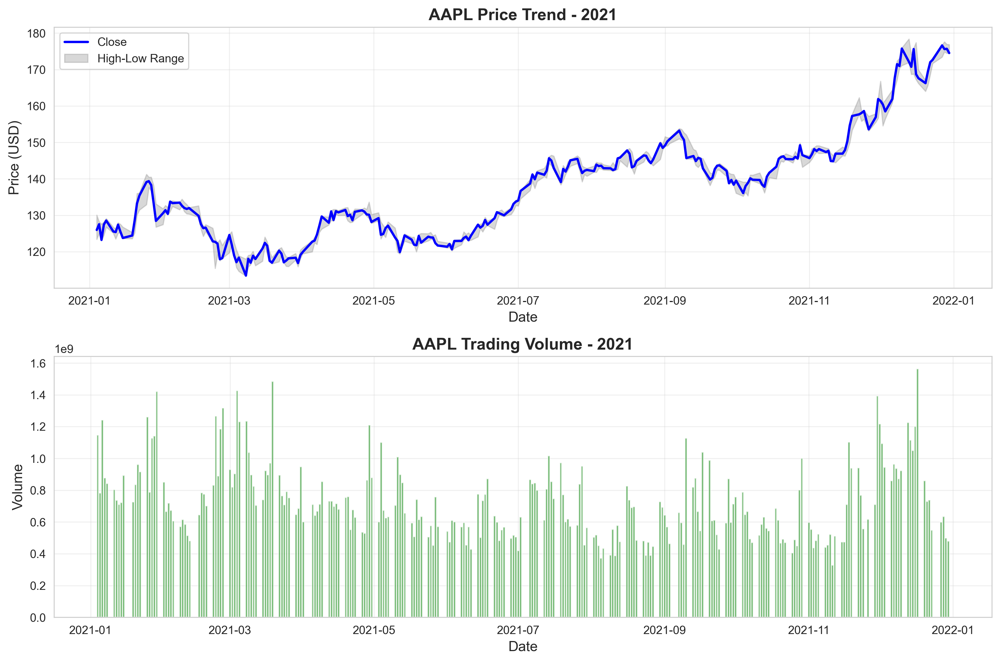

---

### 2.2 AMC

#### 收盘价统计

| 指标 | 数值 |
|------|------|
| 均值 | $276.63 |
| 中位数 | $320.40 |
| 标准差 | $168.18 |
| 最小值 | $19.80 |
| 最大值 | $625.50 |

#### 价格范围

| 指标 | 数值 |
|------|------|
| 开盘价均值 | $276.56 |
| 最高价均值 | $293.41 |
| 最低价均值 | $261.63 |

#### 价格极值

| 类型 | 日期 | 价格 |
|------|------|------|
| 最高价 | 2021-06-02 13:30 | $726.20 |
| 最低价 | 2021-01-05 14:30 | $19.10 |

#### 成交量统计

| 指标 | 数值 |
|------|------|
| 平均成交量 | 11,487,705 |
| 中位数成交量 | 6,482,380 |
| 总成交量 | 23,067,312,320 |
| 最大成交量 | 122,234,250 |
| 最大成交量日期 | 2021-01-27 14:30 |

#### 收益率与波动率

| 指标 | 数值 |
|------|------|
| 平均收益率 | 0.2941% |
| 收益率标准差 | 7.8973% |
| 年化波动率 | 354.59% |
| 最大单期收益 | 301.21% |
| 最大单期亏损 | -56.63% |

#### 数据质量

| 检查项 | 结果 |
|--------|------|
| 缺失值总数 | 0 |
| 零成交量记录 | 0 |
| 负价格记录 | 0 |

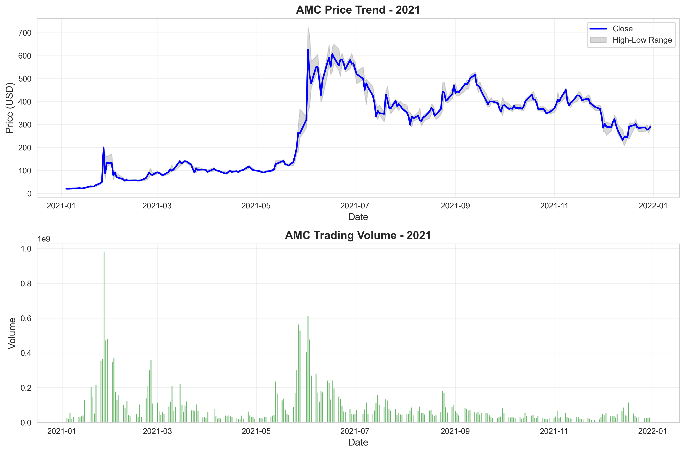

---

### 2.3 AMD

#### 收盘价统计

| 指标 | 数值 |
|------|------|
| 均值 | $100.98 |
| 中位数 | $92.15 |
| 标准差 | $23.26 |
| 最小值 | $73.09 |
| 最大值 | $161.91 |

#### 价格范围

| 指标 | 数值 |
|------|------|
| 开盘价均值 | $100.93 |
| 最高价均值 | $102.79 |
| 最低价均值 | $99.07 |

#### 价格极值

| 类型 | 日期 | 价格 |
|------|------|------|
| 最高价 | 2021-11-30 14:30 | $164.46 |
| 最低价 | 2021-05-13 13:30 | $72.50 |

#### 成交量统计

| 指标 | 数值 |
|------|------|
| 平均成交量 | 51,258,089 |
| 中位数成交量 | 44,735,100 |
| 总成交量 | 102,926,242,400 |
| 最大成交量 | 225,368,700 |
| 最大成交量日期 | 2021-08-04 13:30 |

#### 收益率与波动率

| 指标 | 数值 |
|------|------|
| 平均收益率 | 0.0270% |
| 收益率标准差 | 0.9500% |
| 年化波动率 | 42.66% |
| 最大单期收益 | 10.14% |
| 最大单期亏损 | -6.20% |

#### 数据质量

| 检查项 | 结果 |
|--------|------|
| 缺失值总数 | 0 |
| 零成交量记录 | 0 |
| 负价格记录 | 0 |

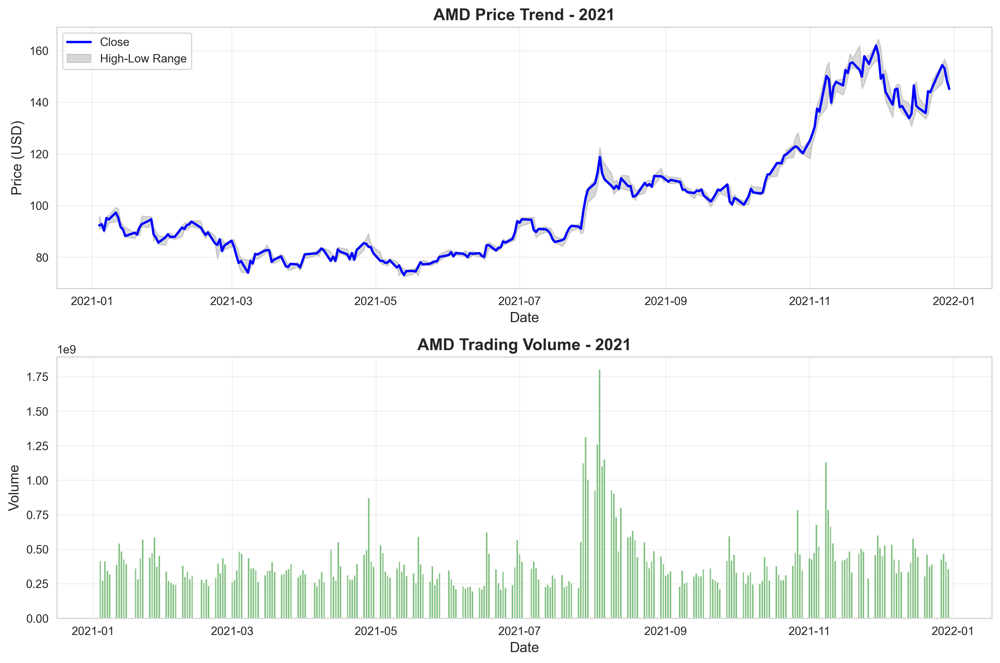

---

### 2.4 BB

#### 收盘价统计

| 指标 | 数值 |
|------|------|
| 均值 | $10.54 |
| 中位数 | $10.17 |
| 标准差 | $2.05 |
| 最小值 | $6.58 |
| 最大值 | $25.10 |

#### 价格范围

| 指标 | 数值 |
|------|------|
| 开盘价均值 | $10.58 |
| 最高价均值 | $10.98 |
| 最低价均值 | $10.17 |

#### 价格极值

| 类型 | 日期 | 价格 |
|------|------|------|
| 最高价 | 2021-01-27 14:30 | $28.77 |
| 最低价 | 2021-01-04 14:30 | $6.52 |

#### 成交量统计

| 指标 | 数值 |
|------|------|
| 平均成交量 | 27,595,534 |
| 中位数成交量 | 10,341,700 |
| 总成交量 | 55,411,832,000 |
| 最大成交量 | 536,739,400 |
| 最大成交量日期 | 2021-06-03 13:30 |

#### 收益率与波动率

| 指标 | 数值 |
|------|------|
| 平均收益率 | 0.0444% |
| 收益率标准差 | 2.2793% |
| 年化波动率 | 102.34% |
| 最大单期收益 | 32.66% |
| 最大单期亏损 | -41.63% |

#### 数据质量

| 检查项 | 结果 |
|--------|------|
| 缺失值总数 | 0 |
| 零成交量记录 | 0 |
| 负价格记录 | 0 |

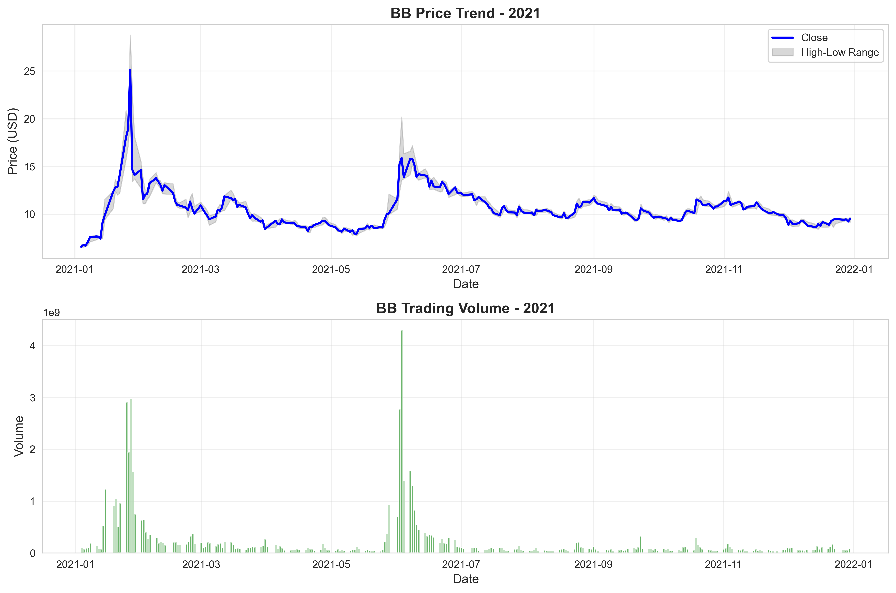

---

### 2.5 GME

#### 收盘价统计

| 指标 | 数值 |
|------|------|
| 均值 | $42.45 |
| 中位数 | $44.53 |
| 标准差 | $14.39 |
| 最小值 | $4.31 |
| 最大值 | $86.88 |

#### 价格范围

| 指标 | 数值 |
|------|------|
| 开盘价均值 | $42.78 |
| 最高价均值 | $45.49 |
| 最低价均值 | $40.10 |

#### 价格极值

| 类型 | 日期 | 价格 |
|------|------|------|
| 最高价 | 2021-01-28 14:30 | $120.75 |
| 最低价 | 2021-01-08 14:30 | $4.27 |

#### 成交量统计

| 指标 | 数值 |
|------|------|
| 平均成交量 | 57,534,457 |
| 中位数成交量 | 17,174,000 |
| 总成交量 | 115,529,190,400 |
| 最大成交量 | 788,631,600 |
| 最大成交量日期 | 2021-01-22 14:30 |

#### 收益率与波动率

| 指标 | 数值 |
|------|------|
| 平均收益率 | 0.2542% |
| 收益率标准差 | 6.0363% |
| 年化波动率 | 271.03% |
| 最大单期收益 | 134.84% |
| 最大单期亏损 | -60.00% |

#### 数据质量

| 检查项 | 结果 |
|--------|------|
| 缺失值总数 | 0 |
| 零成交量记录 | 0 |
| 负价格记录 | 0 |

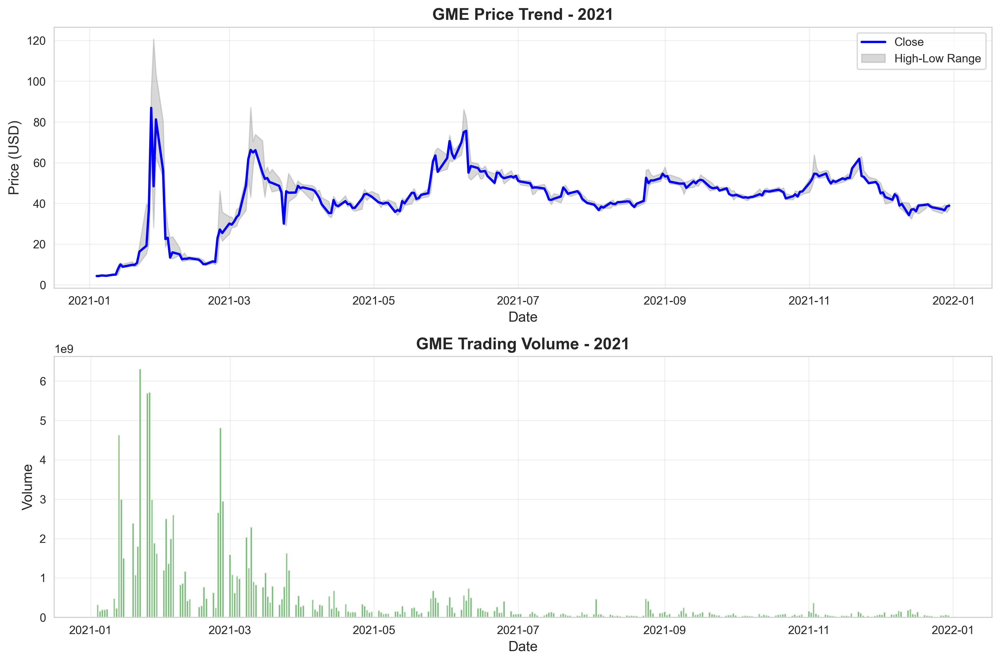

---

### 2.6 HOOD

#### 收盘价统计

| 指标 | 数值 |
|------|------|
| 均值 | $37.02 |
| 中位数 | $40.52 |
| 标准差 | $10.55 |
| 最小值 | $17.11 |
| 最大值 | $70.39 |

#### 价格范围

| 指标 | 数值 |
|------|------|
| 开盘价均值 | $37.17 |
| 最高价均值 | $38.52 |
| 最低价均值 | $35.92 |

#### 价格极值

| 类型 | 日期 | 价格 |
|------|------|------|
| 最高价 | 2021-08-04 13:30 | $85.00 |
| 最低价 | 2021-12-29 14:30 | $16.68 |

#### 成交量统计

| 指标 | 数值 |
|------|------|
| 平均成交量 | 15,442,636 |
| 中位数成交量 | 10,762,450 |
| 总成交量 | 13,342,437,600 |
| 最大成交量 | 175,790,500 |
| 最大成交量日期 | 2021-08-04 13:30 |

#### 收益率与波动率

| 指标 | 数值 |
|------|------|
| 平均收益率 | -0.0445% |
| 收益率标准差 | 2.5898% |
| 年化波动率 | 116.28% |
| 最大单期收益 | 50.41% |
| 最大单期亏损 | -27.59% |

#### 数据质量

| 检查项 | 结果 |
|--------|------|
| 缺失值总数 | 0 |
| 零成交量记录 | 0 |
| 负价格记录 | 0 |

---

### 2.7 NIO

#### 收盘价统计

| 指标 | 数值 |
|------|------|
| 均值 | $42.16 |
| 中位数 | $40.47 |
| 标准差 | $7.74 |
| 最小值 | $28.16 |
| 最大值 | $62.84 |

#### 价格范围

| 指标 | 数值 |
|------|------|
| 开盘价均值 | $42.28 |
| 最高价均值 | $43.38 |
| 最低价均值 | $40.97 |

#### 价格极值

| 类型 | 日期 | 价格 |
|------|------|------|
| 最高价 | 2021-01-11 14:30 | $66.99 |
| 最低价 | 2021-12-29 14:30 | $27.52 |

#### 成交量统计

| 指标 | 数值 |
|------|------|
| 平均成交量 | 67,781,311 |
| 中位数成交量 | 56,805,800 |
| 总成交量 | 136,104,872,000 |
| 最大成交量 | 279,770,300 |
| 最大成交量日期 | 2021-01-11 14:30 |

#### 收益率与波动率

| 指标 | 数值 |
|------|------|
| 平均收益率 | -0.0141% |
| 收益率标准差 | 1.4782% |
| 年化波动率 | 66.37% |
| 最大单期收益 | 17.44% |
| 最大单期亏损 | -13.00% |

#### 数据质量

| 检查项 | 结果 |
|--------|------|
| 缺失值总数 | 0 |
| 零成交量记录 | 0 |
| 负价格记录 | 0 |

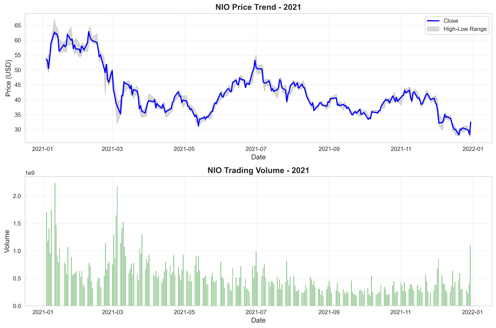

---

### 2.8 NOK

#### 收盘价统计

| 指标 | 数值 |
|------|------|
| 均值 | $4.64 |
| 中位数 | $4.90 |
| 标准差 | $0.70 |
| 最小值 | $3.43 |
| 最大值 | $5.88 |

#### 价格范围

| 指标 | 数值 |
|------|------|
| 开盘价均值 | $4.65 |
| 最高价均值 | $4.72 |
| 最低价均值 | $4.59 |

#### 价格极值

| 类型 | 日期 | 价格 |
|------|------|------|
| 最高价 | 2021-01-27 14:30 | $8.79 |
| 最低价 | 2021-03-04 14:30 | $3.37 |

#### 成交量统计

| 指标 | 数值 |
|------|------|
| 平均成交量 | 44,625,644 |
| 中位数成交量 | 25,984,600 |
| 总成交量 | 89,608,292,800 |
| 最大成交量 | 1,123,003,300 |
| 最大成交量日期 | 2021-01-27 14:30 |

#### 收益率与波动率

| 指标 | 数值 |
|------|------|
| 平均收益率 | 0.0327% |
| 收益率标准差 | 1.3652% |
| 年化波动率 | 61.30% |
| 最大单期收益 | 38.48% |
| 最大单期亏损 | -28.40% |

#### 数据质量

| 检查项 | 结果 |
|--------|------|
| 缺失值总数 | 0 |
| 零成交量记录 | 0 |
| 负价格记录 | 0 |

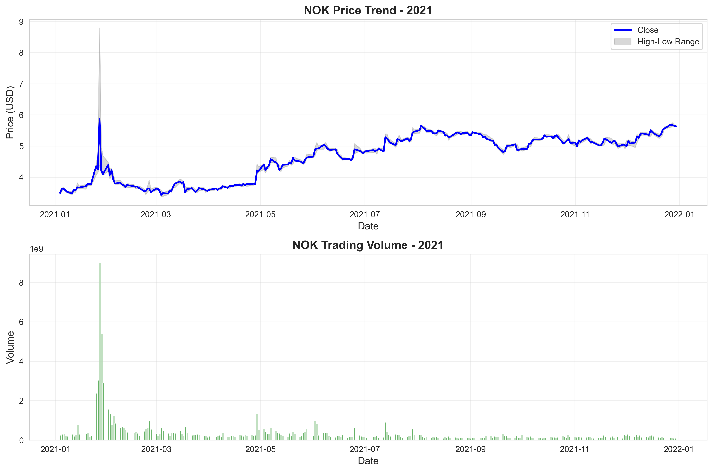

---

### 2.9 PLTR

#### 收盘价统计

| 指标 | 数值 |
|------|------|
| 均值 | $24.25 |
| 中位数 | $24.01 |
| 标准差 | $3.62 |
| 最小值 | $17.96 |
| 最大值 | $39.00 |

#### 价格范围

| 指标 | 数值 |
|------|------|
| 开盘价均值 | $24.31 |
| 最高价均值 | $24.97 |
| 最低价均值 | $23.58 |

#### 价格极值

| 类型 | 日期 | 价格 |
|------|------|------|
| 最高价 | 2021-01-27 14:30 | $45.00 |
| 最低价 | 2021-05-11 13:30 | $17.06 |

#### 成交量统计

| 指标 | 数值 |
|------|------|
| 平均成交量 | 56,274,209 |
| 中位数成交量 | 44,495,200 |
| 总成交量 | 112,998,611,200 |
| 最大成交量 | 320,063,700 |
| 最大成交量日期 | 2021-02-19 14:30 |

#### 收益率与波动率

| 指标 | 数值 |
|------|------|
| 平均收益率 | -0.0009% |
| 收益率标准差 | 1.4515% |
| 年化波动率 | 65.17% |
| 最大单期收益 | 25.40% |
| 最大单期亏损 | -12.75% |

#### 数据质量

| 检查项 | 结果 |
|--------|------|
| 缺失值总数 | 0 |
| 零成交量记录 | 0 |
| 负价格记录 | 0 |

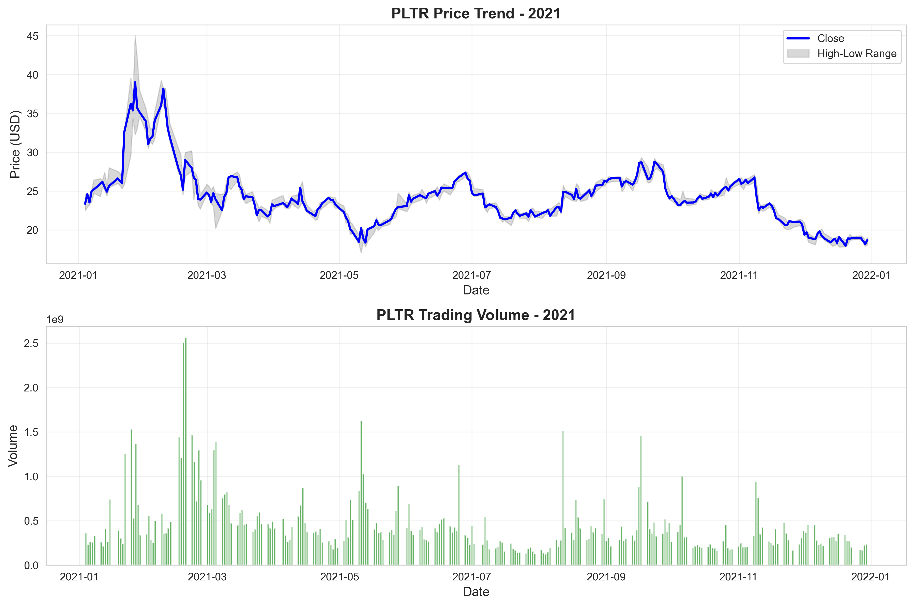

---

### 2.10 SNDL

#### 收盘价统计

| 指标 | 数值 |
|------|------|
| 均值 | $8.82 |
| 中位数 | $7.90 |
| 标准差 | $3.14 |
| 最小值 | $5.40 |
| 最大值 | $29.50 |

#### 价格范围

| 指标 | 数值 |
|------|------|
| 开盘价均值 | $8.93 |
| 最高价均值 | $9.37 |
| 最低价均值 | $8.40 |

#### 价格极值

| 类型 | 日期 | 价格 |
|------|------|------|
| 最高价 | 2021-02-11 14:30 | $39.60 |
| 最低价 | 2021-01-04 14:30 | $4.70 |

#### 成交量统计

| 指标 | 数值 |
|------|------|
| 平均成交量 | 23,678,024 |
| 中位数成交量 | 12,489,090 |
| 总成交量 | 47,545,472,720 |
| 最大成交量 | 294,029,660 |
| 最大成交量日期 | 2021-02-11 14:30 |

#### 收益率与波动率

| 指标 | 数值 |
|------|------|
| 平均收益率 | 0.0459% |
| 收益率标准差 | 3.1522% |
| 年化波动率 | 141.53% |
| 最大单期收益 | 78.79% |
| 最大单期亏损 | -21.46% |

#### 数据质量

| 检查项 | 结果 |
|--------|------|
| 缺失值总数 | 0 |
| 零成交量记录 | 0 |
| 负价格记录 | 0 |

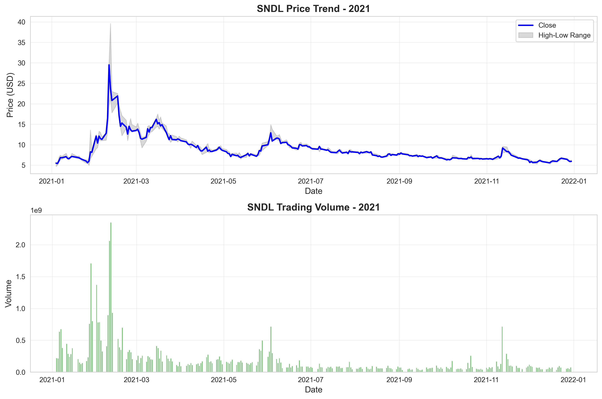

---

### 2.11 SOFI

#### 收盘价统计

| 指标 | 数值 |
|------|------|
| 均值 | $18.06 |
| 中位数 | $17.27 |
| 标准差 | $2.96 |
| 最小值 | $12.12 |
| 最大值 | $25.78 |

#### 价格范围

| 指标 | 数值 |
|------|------|
| 开盘价均值 | $18.14 |
| 最高价均值 | $18.71 |
| 最低价均值 | $17.49 |

#### 价格极值

| 类型 | 日期 | 价格 |
|------|------|------|
| 最高价 | 2021-02-01 14:30 | $28.26 |
| 最低价 | 2021-01-04 14:30 | $11.80 |

#### 成交量统计

| 指标 | 数值 |
|------|------|
| 平均成交量 | 17,032,368 |
| 中位数成交量 | 13,941,200 |
| 总成交量 | 34,200,995,200 |
| 最大成交量 | 72,680,100 |
| 最大成交量日期 | 2021-11-11 14:30 |

#### 收益率与波动率

| 指标 | 数值 |
|------|------|
| 平均收益率 | 0.0329% |
| 收益率标准差 | 2.1051% |
| 年化波动率 | 94.52% |
| 最大单期收益 | 57.92% |
| 最大单期亏损 | -14.15% |

#### 数据质量

| 检查项 | 结果 |
|--------|------|
| 缺失值总数 | 0 |
| 零成交量记录 | 0 |
| 负价格记录 | 0 |

---

### 2.12 TSLA

#### 收盘价统计

| 指标 | 数值 |
|------|------|
| 均值 | $259.63 |
| 中位数 | $243.26 |
| 标准差 | $53.43 |
| 最小值 | $187.67 |
| 最大值 | $409.97 |

#### 价格范围

| 指标 | 数值 |
|------|------|
| 开盘价均值 | $259.56 |
| 最高价均值 | $264.86 |
| 最低价均值 | $253.85 |

#### 价格极值

| 类型 | 日期 | 价格 |
|------|------|------|
| 最高价 | 2021-11-04 13:30 | $414.50 |
| 最低价 | 2021-03-05 14:30 | $179.83 |

#### 成交量统计

| 指标 | 数值 |
|------|------|
| 平均成交量 | 82,339,991 |
| 中位数成交量 | 74,438,100 |
| 总成交量 | 165,338,702,400 |
| 最大成交量 | 268,189,500 |
| 最大成交量日期 | 2021-03-05 14:30 |

#### 收益率与波动率

| 指标 | 数值 |
|------|------|
| 平均收益率 | 0.0264% |
| 收益率标准差 | 1.2196% |
| 年化波动率 | 54.76% |
| 最大单期收益 | 19.64% |
| 最大单期亏损 | -11.99% |

#### 数据质量

| 检查项 | 结果 |
|--------|------|
| 缺失值总数 | 0 |
| 零成交量记录 | 0 |
| 负价格记录 | 0 |

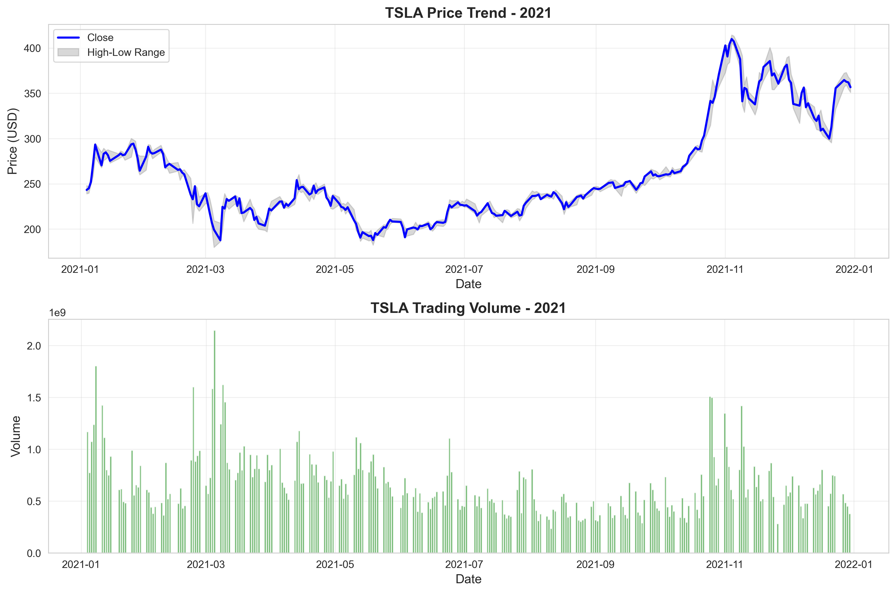

---

## 3. 综合对比分析

### 3.1 价格走势对比

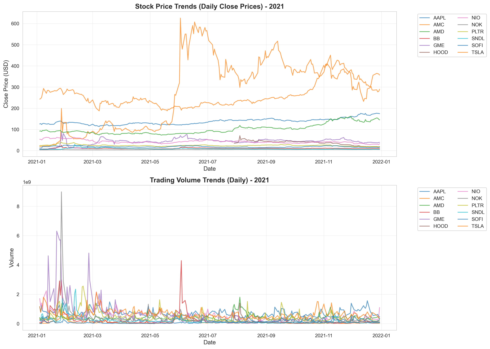

### 3.2 分布分析

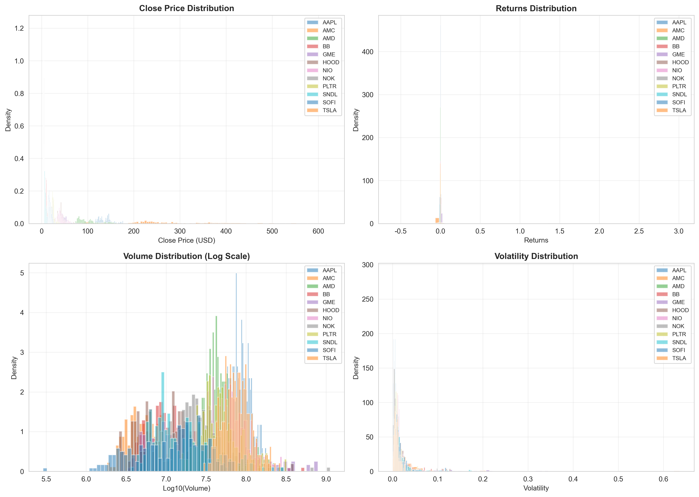

### 3.3 相关性分析

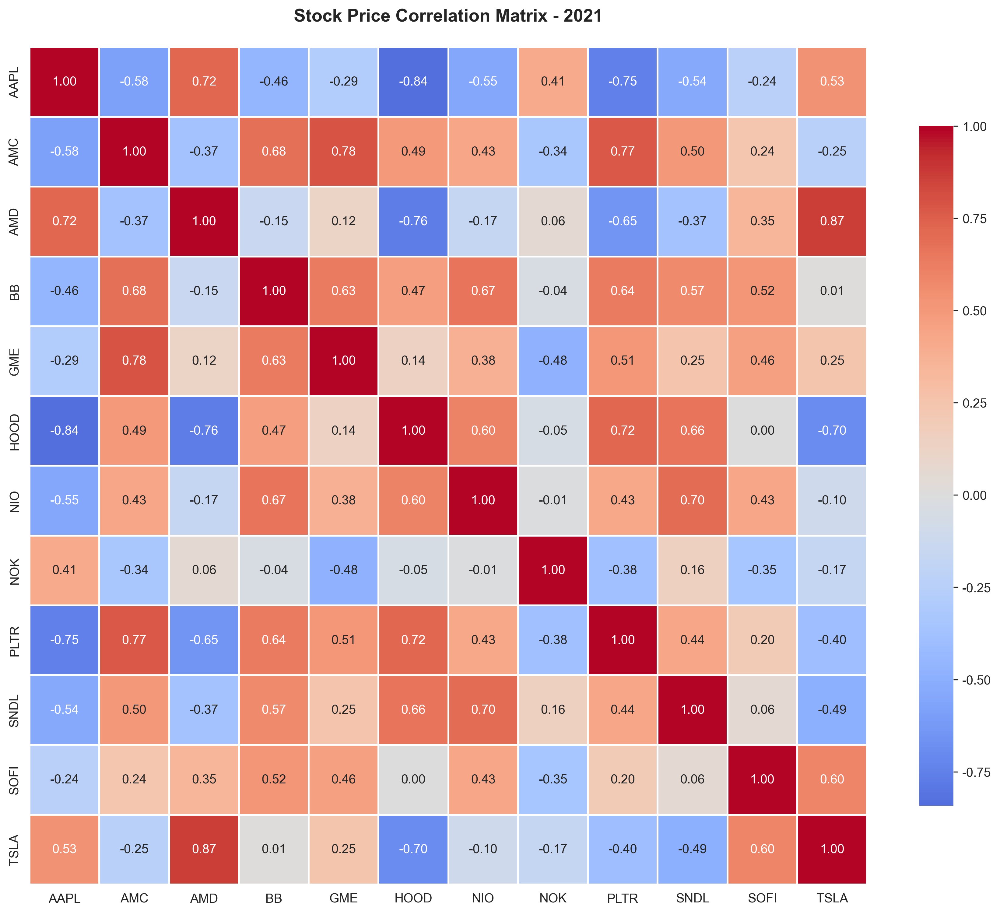

### 3.4 波动率与收益率对比

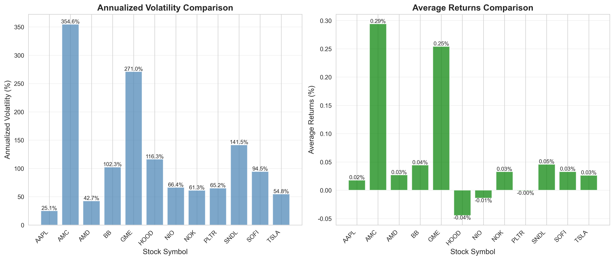

## 4. 数据质量总结

### 4.1 数据完整性

- 成功分析股票数量: **12** 只
- 总数据行数: **22,952** 行

### 4.2 数据质量评估

- 缺失值总数: 0
- 零成交量记录: 0
- 负价格记录: 0

✅ **数据质量优秀**: 无缺失值和异常值
